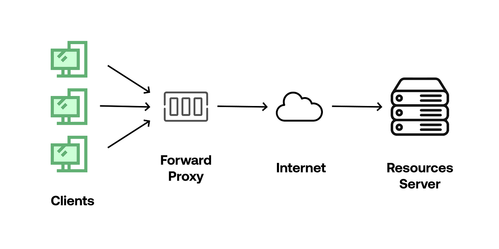

# Network devices

## Load balancers

A load balancer is a device/algorithm used to distribute traffic in a network among a group servers. This prevents overloading of servers, _balancing_ the traffic among them.

### Security

Since the Load balancer lies between the server and the client, it is able to hold the SSL certificates _instead of the servers themselves_. As the servers and the load balancer will be in the same network, the load balancer becomes encharged of encrypting and decrypting packets coming from clients. Enabling for quick and unencrypted communication between the servers and the load balancer.

### Algorithms

#### Static balancing

Workload is distributed without consideration of the currentstate of the system.

- **Round-robin:**
  All the processes are added to a queu given a set time to perform a task. If the task is finished before the allocated time then the next task is loaded. Else, the task goes to the back to the queu to wait for another turn.
- **Fixed-weighting:**
  Every server is assigned a weight. All the traffic will go to that server until it fails. The traffic is then redirected to the server with the next highest weight. Useful if one server can handle all expected traffic with backup servers as failsaves.
- **IP hash:**
  A unique hash key is generated to assign a client to a specific server which the client will return to every time. This is useful when the client needs to return to the same server every time.
- **URL hash:**
  Same as above but with URL used on client request. Ensures that the same server is used for specific URL requests.

#### Dynamic balancing:

These algorithms can shift traffic allocation on the go. Taking consideration of server's availability, workload, etc.

- **Least-Connections:**
  Traffic is distributed to the current server with the least number of connections at the time. Useful when the servers have fairly similar specifications.
- **Fastest response:**
  Server's response are continously measured and traffic is assigned to the fastest server at any one time. However, continous monitoring adds overheads on the network which should be considered.

### Challenges

While adding a Load balancer improves server resource management, it creates a situation where the whole network depends on the reliability of the Load balancer -- if the load balancer fails the network fails.

- **Clustering:**
  Additional Load balancer can be added, but this becomes a challenge if methods like IP hashing are needed. This is because the load balancers need to retain a shared memory of client requests. While this is possible, it is expensive and adds complexity to the network.

## Proxies

intermediary device that stand between users and websites. There are two kinds:

### Forward Proxies:

Placed before client's requests leave a local network. It is useful for:

1. Locally _caching_ content that is frequently requested.
2. _Filter_ content being requested by local clients.
3. _Anonymises_ local clients as the requests are then made by the forward proxie.
   

## Reverse proxie

Placed at the interface between a local network of servers and the internet. Can be used for:

1. _Load balancing_
2. _Protection_, the IP of the server remains hidden by preventing the client from direcly connecting to the server.
3. SSL termination. See load balancer security section.
4. _Caching_ content, lifting the load from servers.
   

## Firewalls

Soft- or Hard-ware program which restricts acess to a network based on a set of rules. It can also encrypt data before transmition.

### Micro-segmentation

A method which divides the network into different compartments with different security protocols and requirements. This allows different uses with different security needs to still work in the same network.

### Firewall models

- **Packet filtering:** Assesses each packet against some security criteria. It is fast, cheap and resource light. However, it has a limited granularity in its filtering. Weak against spoofing.
- **Circuit-level gateway:** Checks TCP handshakes (checks the headder of packets) to stablish if the connection between the host and device is valid. Cheap and fast. However, lacks further protections against internal issues which can cause data leaks. Requires on going updates.
- **Stateful inspection:** Examines each packet's IP, payloads, and the session state of connection. Offers high grannularity of filtering control. However, it is resource intensive, expensive and cannot validate traffic sources to prevent spoofing.
