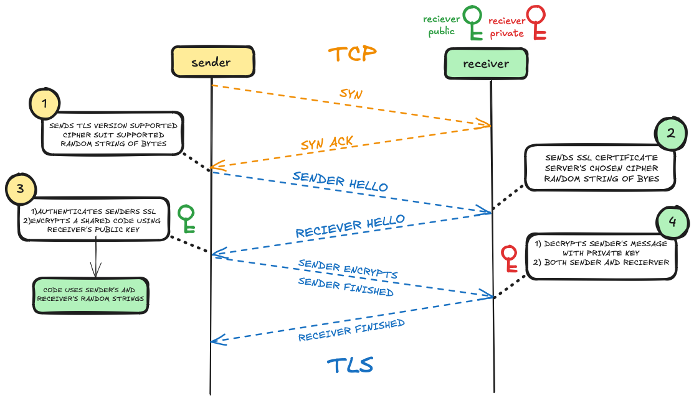
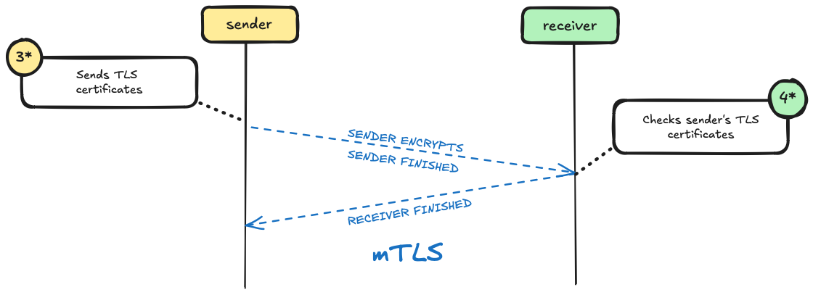

# TLS

After a connection is made, it needs to be made secure. TLS is a security protocol used for this. Using TLS an encryption key can be shared securely, allowing only the sender and reciever to decrypt messages. See below for how a TLS connection is established.

In here only the sender checks the credentials and only the reciever's keys are used.

# mTLS

mTLS adds an addtional level of security where the reciever also checks the SSL certificates of the sender. Modifying steps 3 and 4 of the diagram above. see image below.

## Where is it used?

It is needed when the reciever needs to also verify the origin of the sender. This is useful when the reciever contains information that does not want to be shared with the general public.
